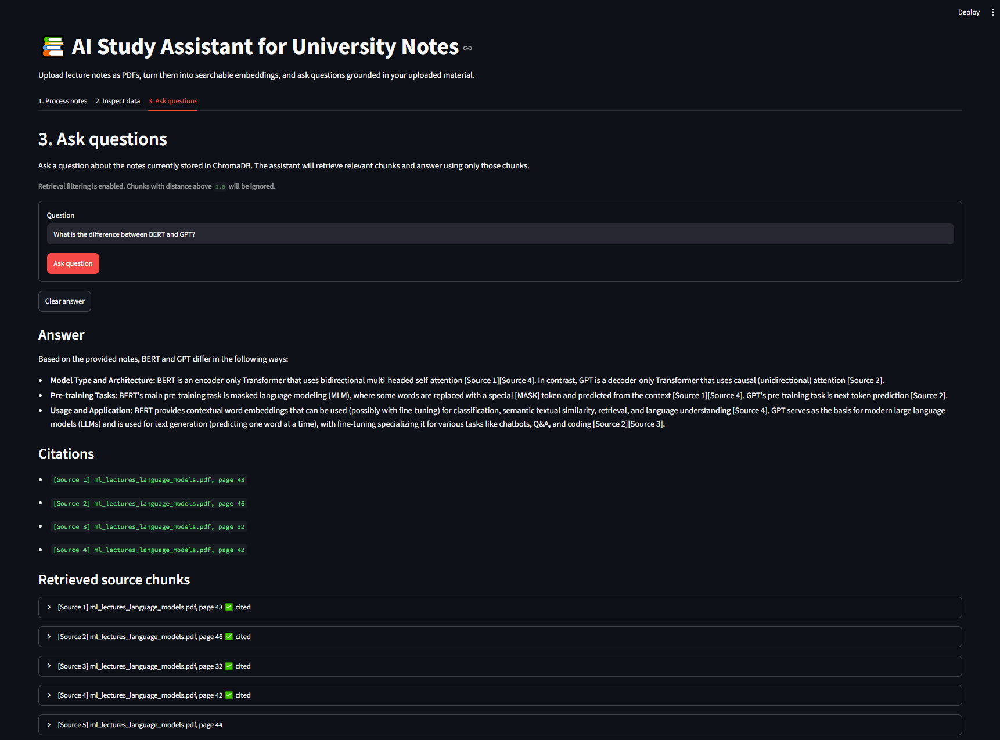
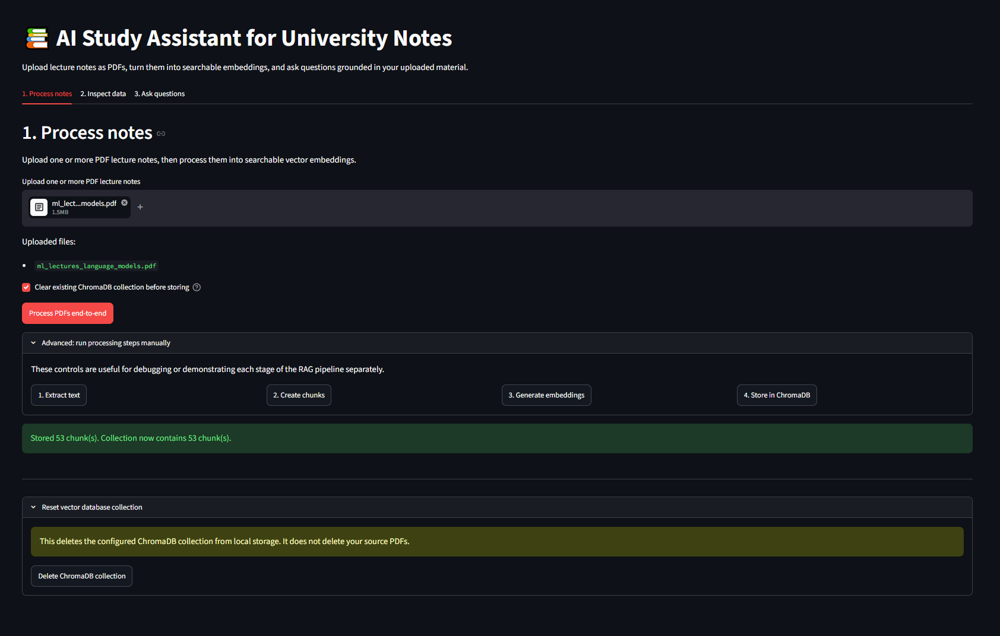

# AI Study Assistant for University Notes

A retrieval-augmented generation (RAG) web application that lets students upload university lecture notes as PDFs and ask questions grounded in the uploaded material.

The app extracts text from PDFs, chunks the text, generates local embeddings with Sentence Transformers, stores them in ChromaDB, retrieves relevant chunks for each question, and uses an OpenAI-compatible chat model to generate answers with source citations.

## Screenshots

### Asking a question with source citations



### Uploading and processing PDF notes



## Project Overview

The goal of this project is to help students study from their own lecture notes.

Instead of asking a language model to answer from general knowledge, the app retrieves relevant passages from the uploaded PDFs and instructs the model to answer only from those passages.

If the answer cannot be found in the uploaded notes, the assistant responds:

```text
I could not find this in the uploaded notes.
```

## Features

- Upload one or more PDF lecture notes
- Extract text page by page using PyMuPDF
- Split text into overlapping chunks
- Generate local embeddings using Sentence Transformers
- Store embeddings, text, and metadata in ChromaDB
- Ask natural language questions about uploaded notes
- Retrieve semantically relevant chunks from the vector database
- Generate grounded answers using any OpenAI-compatible chat model (OpenAI, Gemini, Groq, Ollama)
- Answer only from your uploaded notes, and say so when something cannot be found
- Display source citations with file names, page numbers, and retrieved chunk text
- Retrieval distance filtering to reduce weak or irrelevant matches
- Streamlit web interface with:
  - end-to-end PDF processing
  - data inspection tools
  - question-answering interface
- Automated test suite with pytest
- Coverage reporting with pytest-cov

## Tech Stack

| Area | Technology |
|---|---|
| Language | Python 3.11 |
| Web UI | Streamlit |
| PDF extraction | PyMuPDF |
| Embeddings | Sentence Transformers |
| Embedding model | `all-MiniLM-L6-v2` |
| Vector database | ChromaDB |
| LLM API | OpenAI-compatible chat API |
| Environment variables | python-dotenv |
| Testing | pytest, pytest-cov |

## How It Works

The application follows a RAG pipeline:

```text
PDF upload
   ↓
Page-by-page text extraction
   ↓
Text chunking with overlap
   ↓
Embedding generation
   ↓
ChromaDB vector storage
   ↓
User question
   ↓
Question embedding
   ↓
Semantic retrieval
   ↓
Prompt construction
   ↓
LLM answer generation
   ↓
Answer with citations
```

## What is RAG?

RAG stands for Retrieval-Augmented Generation.

A normal chatbot answers mostly from its training data. A RAG system first retrieves relevant information from a trusted source, such as uploaded lecture notes, and then gives that information to the language model as context.

This helps the model produce answers that are more grounded, traceable, and relevant to the user's documents.

## Project Structure

```text
AI-study-assistant/
├── app.py
├── requirements.txt
├── .env.example
├── .gitignore
├── pytest.ini
├── README.md
├── docs/
│   ├── AI-assistant-answer-example.png
│   └── AI-assistant-uploadfile-example.png
├── storage/
│   └── .gitkeep
├── src/
│   ├── __init__.py
│   ├── chunker.py
│   ├── citations.py
│   ├── config.py
│   ├── embeddings.py
│   ├── models.py
│   ├── pdf_loader.py
│   ├── prompts.py
│   ├── rag_pipeline.py
│   ├── ui_helpers.py
│   └── vector_store.py
└── tests/
    ├── helpers.py
    ├── test_chunker.py
    ├── test_citations.py
    ├── test_config.py
    ├── test_config_phase9.py
    ├── test_embeddings.py
    ├── test_end_to_end_pipeline.py
    ├── test_pdf_loader.py
    ├── test_pdf_loader_robustness.py
    ├── test_phase10_edge_cases.py
    ├── test_prompts.py
    ├── test_rag_pipeline.py
    ├── test_rag_pipeline_robustness.py
    ├── test_ui_helpers.py
    ├── test_vector_store.py
    └── test_vector_store_robustness.py
```

## Setup

### 1. Clone the repository

```bash
git clone https://github.com/JesseSaarinen/AI-study-assistant.git
cd AI-study-assistant
```

### 2. Create a virtual environment

#### Windows PowerShell

```powershell
py -3.11 -m venv .venv
.\.venv\Scripts\Activate.ps1
```

If PowerShell blocks activation, run:

```powershell
Set-ExecutionPolicy -ExecutionPolicy RemoteSigned -Scope CurrentUser
```

Then activate again:

```powershell
.\.venv\Scripts\Activate.ps1
```

#### macOS/Linux

```bash
python3.11 -m venv .venv
source .venv/bin/activate
```

### 3. Install dependencies

```bash
python -m pip install --upgrade pip
pip install -r requirements.txt
```

The first install can take several minutes because `sentence-transformers` depends on PyTorch.

### 4. Create your environment file

Copy the example file:

#### Windows PowerShell

```powershell
Copy-Item .env.example .env
```

#### macOS/Linux

```bash
cp .env.example .env
```

Then edit `.env` and add your API key.

Example:

```env
OPENAI_API_KEY=your_real_api_key_here
OPENAI_BASE_URL=https://api.openai.com/v1
OPENAI_MODEL=gpt-4o-mini

EMBEDDING_MODEL_NAME=all-MiniLM-L6-v2

CHROMA_DB_DIR=storage/chroma
CHROMA_COLLECTION_NAME=study_notes

CHUNK_SIZE=1000
CHUNK_OVERLAP=150
TOP_K=5

RETRIEVAL_DISTANCE_THRESHOLD=1.0
MAX_UPLOADED_FILE_MB=50
```

Do not commit your real `.env` file to GitHub.

### Using other LLM providers

The chat model is accessed through the OpenAI Python client, so any OpenAI-compatible API works. The variable names start with `OPENAI_` for that reason. Change these values in `.env`:

| Provider | `OPENAI_BASE_URL` | Example `OPENAI_MODEL` |
|---|---|---|
| OpenAI | `https://api.openai.com/v1` | `gpt-4o-mini` |
| Google Gemini | `https://generativelanguage.googleapis.com/v1beta/openai/` | `gemini-3.5-flash-lite` |
| Groq | `https://api.groq.com/openai/v1` | `llama-3.3-70b-versatile` |
| Ollama (local) | `http://localhost:11434/v1` | `llama3.2` |

Gemini and Groq both offer free tiers. For Ollama, install it locally, pull a model, and set `OPENAI_API_KEY` to any non-empty value such as `ollama`. Model names change often, so check your provider's current model list.

## Running the App

From the project root:

```bash
streamlit run app.py
```

Then open:

```text
http://localhost:8501
```

## Using the App

### 1. Process Notes

Go to the **Process notes** tab.

Upload one or more PDF lecture notes and click:

```text
Process PDFs end-to-end
```

The app will:

1. Extract text from PDFs
2. Create text chunks
3. Generate embeddings
4. Store embeddings in ChromaDB

The first run downloads the embedding model, so it may take a little longer.

### 2. Inspect Data

Go to the **Inspect data** tab.

You can inspect:

- extracted PDF text
- generated chunks
- embedding previews
- stored ChromaDB records

This is useful for debugging and for understanding the RAG pipeline.

### 3. Ask Questions

Go to the **Ask questions** tab.

Ask a question such as:

```text
What is the difference between BERT and GPT?
```

The assistant retrieves relevant chunks from your notes and generates an answer using only those chunks.

If the answer is not found, it responds:

```text
I could not find this in the uploaded notes.
```

## Source Citations

Answers include source markers such as:

```text
GPT uses a decoder-only Transformer with causal attention. [Source 2]
```

The app displays each source with:

- source number
- PDF file name
- page number
- chunk ID
- retrieved chunk text
- similarity distance

Example:

```text
[Source 2] lecture_notes.pdf, page 46
```

Sources the answer actually relied on are marked as cited, which makes answers traceable back to the uploaded notes.

## Testing

Run the full test suite:

```bash
pytest
```

Run tests with coverage:

```bash
pytest --cov=src --cov-report=term-missing
```

The tests run without external API calls and cover:

- PDF extraction
- PDF error handling
- text chunking
- chunk metadata
- embedding generation
- embedding validation
- ChromaDB storage
- vector retrieval
- retrieval filtering
- prompt construction
- RAG fallback behaviour
- citation parsing and formatting, including combined markers such as `[Source 1, Source 2]`
- end-to-end local RAG pipeline

## Configuration

The app is configured using environment variables.

| Variable | Purpose |
|---|---|
| `OPENAI_API_KEY` | API key for the OpenAI-compatible chat model |
| `OPENAI_BASE_URL` | Base URL for the chat API |
| `OPENAI_MODEL` | Chat model name |
| `EMBEDDING_MODEL_NAME` | Sentence Transformers model name |
| `CHROMA_DB_DIR` | Local ChromaDB storage path |
| `CHROMA_COLLECTION_NAME` | ChromaDB collection name |
| `CHUNK_SIZE` | Maximum chunk size in characters |
| `CHUNK_OVERLAP` | Overlap between neighbouring chunks |
| `TOP_K` | Number of chunks to retrieve per question |
| `RETRIEVAL_DISTANCE_THRESHOLD` | Maximum allowed retrieval distance |
| `MAX_UPLOADED_FILE_MB` | Maximum allowed PDF upload size |

## Retrieval Distance Threshold

ChromaDB returns a distance score for retrieved chunks.

Lower distance means the chunk is more similar to the question.

The app can filter out weak matches using:

```env
RETRIEVAL_DISTANCE_THRESHOLD=1.0
```

If the assistant is too strict, increase the value:

```env
RETRIEVAL_DISTANCE_THRESHOLD=1.2
```

If it is too permissive, decrease the value:

```env
RETRIEVAL_DISTANCE_THRESHOLD=0.75
```

To disable retrieval filtering:

```env
RETRIEVAL_DISTANCE_THRESHOLD=disabled
```

The right value depends on your documents and embedding model, so the distance of each retrieved chunk is shown in the UI to help with tuning.

## Error Handling

The app handles common issues such as:

- missing API key
- invalid environment variables
- empty PDF uploads
- invalid PDF files
- oversized PDF files
- scanned PDFs with no selectable text
- empty extracted text
- invalid chunking settings
- invalid embedding outputs
- empty ChromaDB collections
- weak retrieval matches

## Limitations

This is an MVP and has some limitations:

- It only works well with PDFs containing selectable text.
- Scanned PDFs require OCR, which is not included.
- The default embedding model is English-focused. For notes in other languages such as Finnish, set `EMBEDDING_MODEL_NAME` to a multilingual model like `paraphrase-multilingual-MiniLM-L12-v2` and re-process your PDFs.
- Slide decks produce short chunks, and repeated headers or footers can add noise to retrieval.
- Citation accuracy depends on the quality of retrieved chunks.
- The LLM may still occasionally produce imperfect answers.
- The app currently uses one ChromaDB collection by default.
- There is no user authentication.
- Uploaded documents are processed locally, but the retrieved text is sent to the configured chat API provider.
- Very large PDFs may be slow to process.
- Tables, diagrams, formulas, and images are not deeply interpreted.

## Future Improvements

Potential improvements include:

- OCR support for scanned PDFs
- removing repeated headers and footers from slide decks
- multi-user accounts
- separate collections per subject/module
- document deletion from ChromaDB
- chat history
- flashcard generation
- summary generation
- quiz generation
- support for DOCX and PowerPoint files
- hybrid keyword plus vector search
- reranking retrieved chunks
- better evaluation metrics for answer quality
- Docker deployment
- cloud deployment

## Security Notes

- API keys are stored in `.env`.
- `.env` should never be committed to GitHub.
- Local ChromaDB files are stored in `storage/chroma`.
- The local vector database is ignored by Git.
- Uploaded PDFs should be treated as private study material and are not stored in the repository.

## Why This Project Is Useful

This project demonstrates practical AI engineering skills:

- building a complete RAG pipeline
- working with embeddings and vector databases
- integrating LLM APIs in a provider-independent way
- designing a usable Streamlit interface
- handling real-world document processing problems
- writing modular, testable Python code
- adding automated tests and coverage reporting
- implementing source citations and fallback behaviour

## License

This project is intended for educational and portfolio use.
